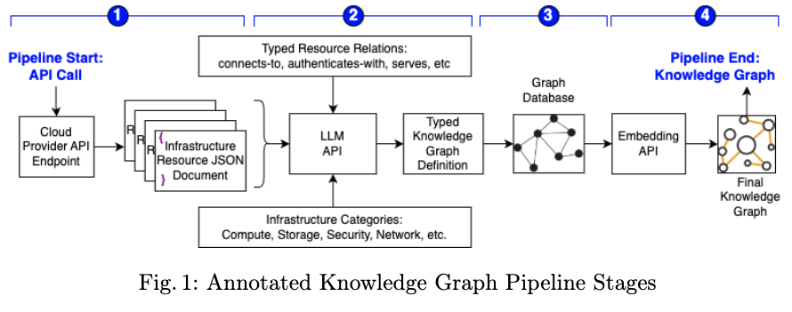
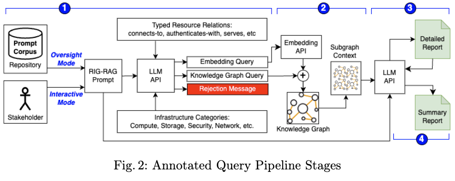

# cnse-public
Public repository to share and reference research artifacts

## Repo Contents

### 1. SkyShark IQ - Public Artifacts for the paper _RIG-RAG: A GraphRAG Inspired Approach to Agentic Cloud Infrastructure_

The folder [./agentic-ai/](./agentic-ai/) contains files that are used in the two pipelines described in the paper. 

**Architecture**

**Artifacts**

_YAMLs that support LLM prompts for both pipelines_

|directory|description|
|---|---|
|[./agentic-ai/cloud-agent/cloud-resources.yaml](./agentic-ai/cloud-agent/cloud-resources.yaml)|Generalized cloud resource archtypes|
|[./agentic-ai/cloud-agent/predicates.yaml](./agentic-ai/cloud-agent/predicates.yaml)|Generalized security-enriched predicate types; defines graph edge types|
|[./agentic-ai/cloud-agent/aws-resources.yaml](./agentic-ai/cloud-agent/aws-resources.yaml)|AWS resource type hints for graph node types|

_SkyShark IQ Full Interaction Reports_

|directory|description|
|---|---|
|[./agentic-ai/skyshark-iq-interactions/1-network-exposure.md](./agentic-ai/skyshark-iq-interactions/1-network-exposure.md)|Initial analysis of network exposure and security risks|
|[./agentic-ai/skyshark-iq-interactions/1a-network-exposure-remediation.md](./agentic-ai/skyshark-iq-interactions/1a-network-exposure-remediation.md)|Follow-up session demonstrating remediation of network exposure issues|
|[./agentic-ai/skyshark-iq-interactions/2-cloud-identities.md](./agentic-ai/skyshark-iq-interactions/2-cloud-identities.md)|Analysis of cloud identity and access management|
|[./agentic-ai/skyshark-iq-interactions/3-discovery-public-domains.md](./agentic-ai/skyshark-iq-interactions/3-discovery-public-domains.md)|Investigation of public domain resources and their security implications|
|[./agentic-ai/skyshark-iq-interactions/4-incident-investigation-MULTI-PROMPT.md](./agentic-ai/skyshark-iq-interactions/4-incident-investigation-MULTI-PROMPT.md)|Multi-prompt incident investigation demonstration|
|[./agentic-ai/skyshark-iq-interactions/5-free-exploration.md](./agentic-ai/skyshark-iq-interactions/5-free-exploration.md)|Open-ended exploration of cloud security analysis capabilities|

## The Team (Current Members)
Brian Mitchell, @architectingsoftware

Spiros Mancoridis, @spirosmancoridis

Ben Lilley, @bdlilley

John Carter, @johnmcarter

Erick Galinkin, @erickgalinkin

Jainam Kashyap, @Jai0987

Rebecca Moroz, @rmoroz20

## Former Team Members (graduates)
Ansh Chandnani, @mrdebator
